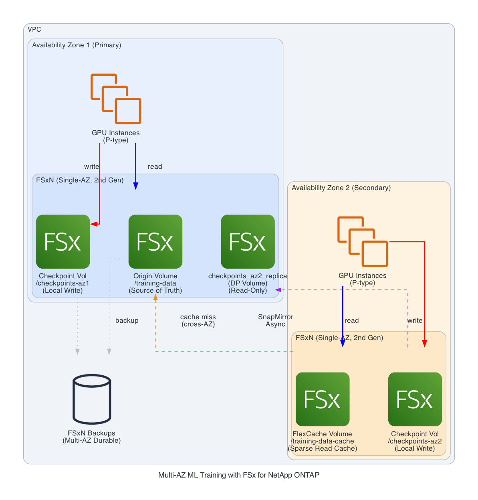

# Accelerating Multi-AZ ML Training with Amazon FSx for NetApp ONTAP and FlexCache

*by Kyongki — March 2026*

---

Machine learning (ML) training workloads demand high-throughput, low-latency access to large datasets. When GPU instances are spread across multiple Availability Zones (AZs) — often due to capacity constraints for P-type instances — data access latency and checkpoint write performance become critical challenges. In this post, we show how to build a single-source-of-truth storage architecture using Amazon FSx for NetApp ONTAP (FSxN) with FlexCache for read caching and local checkpoint volumes with SnapMirror for write optimization across AZs.

## Customer Challenge

Organizations running large-scale ML training frequently encounter this situation:

- **GPU capacity is spread across AZs**: P-type instances (p5.48xlarge, p4d.24xlarge) are in high demand. Customers often cannot get enough GPU instances in a single AZ and must launch across multiple AZs.
- **Training data must be consistent**: All GPU instances across AZs need to read from the same dataset — a single source of truth is essential to avoid version mismatches.
- **Checkpoint writes must be fast**: During training, models write checkpoints frequently (every few minutes to every hour). Cross-AZ write latency slows down the training loop and wastes expensive GPU time.
- **Cost matters**: Multi-AZ FSxN deployments provide high availability but at a higher cost. For ML training workloads that are transient (hours to days), backup-based resilience is often sufficient.

## Solution Overview

Our architecture addresses these challenges with three key design decisions:

1. **FSxN origin in AZ1 (Single-AZ)** — single source of truth for training datasets, with automated backups for resilience
2. **FlexCache in AZ2** — sparse read cache for near-local training data access
3. **Local checkpoint volumes in each AZ** — each AZ writes checkpoints to its own local FSxN volume, then SnapMirror replicates AZ2's checkpoints to AZ1 for cross-AZ availability



### Data Flow

```
READ PATH — Training Data
═══════════════════════════

AZ1 Instances ──read──▶ Origin Volume (local)              [sub-ms latency]

AZ2 Instances ──read──▶ FlexCache Volume (local)
                         ├── Cache HIT  ──▶ Local SSD       [sub-ms latency]
                         └── Cache MISS ──▶ Fetch from Origin ──▶ Cache ──▶ Return
                                            [first read: ~1-2ms, then sub-ms]


WRITE PATH — Checkpoints (Key Design Decision)
═══════════════════════════════════════════════

AZ1 Instances ──write──▶ /checkpoints-az1 (local FSxN)     [sub-ms latency] 
AZ2 Instances ──write──▶ /checkpoints-az2 (local FSxN)     [sub-ms latency] 
                                │
                                ▼  SnapMirror (async)
                         Origin FSxN AZ1: checkpoints_az2_replica (DP volume, AZ2 replica)


RESILIENCE PATH — Backup
════════════════════════

FSxN AZ1 ──automated daily backup──▶ Managed backup storage (multi-AZ durable)
         ──on-demand backup before training──▶ Managed backup storage
         Restore: Create new volume from backup (RPO: hours)
```

## Architecture Components

### 1. FSxN Origin File System (AZ1) — Single Source of Truth

The primary FSxN file system in AZ1 holds the authoritative training dataset, local AZ1 checkpoints, and a SnapMirror replica of AZ2's checkpoints.

- **Deployment type**: Single-AZ (2nd generation) — maximizes throughput, lower cost than Multi-AZ
- **Origin volume** (`/training-data`): Read-only source for training data. AZ1 instances read directly; AZ2 reads via FlexCache
- **Checkpoint volume AZ1** (`/checkpoints-az1`): Local write target for AZ1 training instances
- **AZ2 checkpoint replica** (`checkpoints_az2_replica`): SnapMirror destination that receives a copy of AZ2's checkpoints. This is a data protection (DP) volume — it is read-only while the SnapMirror relationship is active. To access these checkpoints for evaluation or inference, use a FlexClone (instant writable copy) or temporarily break the mirror. Note: this volume only contains AZ2 checkpoints, not AZ1's.
- **Auto-tiering**: Cold datasets and old checkpoints automatically tier to capacity pool storage
- **Automated backups**: Daily incremental backups stored redundantly across multiple AZs by the FSxN service (configurable retention up to 90 days)

### 2. FSxN Cache File System (AZ2) — Local Read + Local Write

A second FSxN file system in AZ2 serves two purposes:

**FlexCache volume** (`/training-data-cache`):
- Sparse read cache backed by the AZ1 origin volume
- First read fetches from origin cross-AZ; subsequent reads served from local SSD
- Ideal for ML training — same data is re-read across epochs

**Local checkpoint volume** (`/checkpoints-az2`):
- AZ2 instances write checkpoints here at local SSD speed — no cross-AZ write penalty
- SnapMirror asynchronously replicates checkpoints to the origin FSxN in AZ1
- Training is never blocked waiting for cross-AZ writes

### Accessing AZ2 Checkpoint Replica (DP Volume Constraint)

The AZ2 checkpoint replica (`checkpoints_az2_replica`) on AZ1 is a SnapMirror data protection (DP) destination — it is **read-only** while the replication relationship is active. This means you cannot directly mount it for read-write access.

To access AZ2 checkpoints for evaluation, inference, or resuming training:

**Option A: FlexClone (recommended)** — Create an instant, writable copy with near-zero storage overhead:
```bash
# On AZ1 FSxN — create a writable clone from the DP volume
volume clone create -vserver svm-primary \
    -flexclone checkpoints_az2_replica_clone \
    -parent-volume checkpoints_az2_replica \
    -junction-path /checkpoints-az2-replica-rw
```
The clone is writable immediately and shares unchanged blocks with the parent — no data copy needed.

> **Important**: FlexClone requires at least one SnapMirror snapshot on the DP volume. Ensure `snapmirror initialize` (Step 6) has completed before attempting to create a FlexClone. Verify with: `snapmirror show -destination-path svm-primary:checkpoints_az2_replica -fields state` (state should be `Snapmirrored`).

**Option B: Break the mirror** — Convert the DP volume to read-write (stops replication):
```bash
snapmirror break -destination-path svm-primary:checkpoints_az2_replica
# Volume is now read-write, but replication is paused
# To resume: snapmirror resync -destination-path svm-primary:checkpoints_az2_replica
```

For most ML workflows, FlexClone is preferred because it doesn't interrupt ongoing SnapMirror replication.

### 3. Resilience via Backups (Not Multi-AZ)

Instead of using Multi-AZ FSxN (which costs more), we use Single-AZ file systems with automated backups:

| Aspect | Multi-AZ FSxN | Single-AZ + Backup (Our Approach) |
|--------|---------------|-----------------------------------|
| Failover | Automatic, seconds | Manual restore, minutes to hours |
| Cost | Higher (synchronous replication) | Lower (no standby) |
| RPO | Near-zero | Hours (last backup) |
| RTO | Seconds | Minutes to hours |
| Best for | 24/7 production workloads | Transient ML training jobs |

For ML training workloads that run for hours to days:
- Training can be restarted from the last checkpoint if a failure occurs
- The cost savings from Single-AZ justify the longer recovery time
- On-demand backups before critical training runs provide additional protection

### 4. GPU Training Instances

GPU instances in both AZs mount two paths:

| Mount | AZ1 Instances | AZ2 Instances |
|-------|---------------|---------------|
| Training data (READ) | `/training-data` (origin, local) | `/training-data-cache` (FlexCache, local after warm-up) |
| Checkpoints (WRITE) | `/checkpoints-az1` (local) | `/checkpoints-az2` (local) |

Both AZs get local-speed writes for checkpoints — no GPU idle time waiting for cross-AZ I/O.

## Why Local Checkpoint Writes Matter

Checkpoint frequency directly impacts training resilience and GPU utilization. Here's the impact of write latency:

```
Scenario: 4x p5.48xlarge per AZ, checkpointing every 10 minutes
          Checkpoint size: 20 GB

Cross-AZ write (write-around FlexCache):
  20 GB ÷ ~500 MBps effective cross-AZ = ~40 seconds per checkpoint
  GPU idle during checkpoint: 40 seconds × 6 checkpoints/hour = 4 min/hour
  GPU utilization loss: ~6.7%

Local write (our approach):
  20 GB ÷ ~2,000 MBps local SSD = ~10 seconds per checkpoint
  GPU idle during checkpoint: 10 seconds × 6 checkpoints/hour = 1 min/hour
  GPU utilization loss: ~1.7%

Savings: ~5% more GPU utilization per hour
At p5.48xlarge pricing, this is significant over multi-day training runs.
```

SnapMirror replication happens asynchronously in the background — it does not block the training loop.

## Implementation Guide

### Step 1: Create FSxN File Systems

```bash
# AZ1 — Primary (origin + local checkpoints)
aws fsx create-file-system \
    --file-system-type ONTAP \
    --storage-capacity 10240 \
    --subnet-ids subnet-az1-xxxxx \
    --ontap-configuration '{
        "DeploymentType": "SINGLE_AZ_2",
        "ThroughputCapacityPerHAPair": 384,
        "PreferredSubnetId": "subnet-az1-xxxxx",
        "AutomaticBackupRetentionDays": 7,
        "DailyAutomaticBackupStartTime": "05:00"
    }' \
    --tags Key=Name,Value=fsxn-ml-primary

# AZ2 — Cache + local checkpoints
aws fsx create-file-system \
    --file-system-type ONTAP \
    --storage-capacity 5120 \
    --subnet-ids subnet-az2-yyyyy \
    --ontap-configuration '{
        "DeploymentType": "SINGLE_AZ_2",
        "ThroughputCapacityPerHAPair": 384,
        "PreferredSubnetId": "subnet-az2-yyyyy",
        "AutomaticBackupRetentionDays": 3
    }' \
    --tags Key=Name,Value=fsxn-ml-cache
```

### Step 2: Create SVMs and Volumes

FSxN creates a default SVM when the file system is provisioned. You can use the default SVM or create named SVMs. Here we create named SVMs for clarity:

```bash
# On AZ1 FSxN — Create SVM (via AWS CLI)
aws fsx create-storage-virtual-machine \
    --file-system-id fs-az1-xxxxx \
    --name svm-primary \
    --root-volume-security-style UNIX

# On AZ2 FSxN — Create SVM
aws fsx create-storage-virtual-machine \
    --file-system-id fs-az2-yyyyy \
    --name svm-cache \
    --root-volume-security-style UNIX
```

Then create volumes via ONTAP CLI. Note: To run ONTAP CLI, you have to aceess FSxN management endpoint with "fsxadmin" user.

```bash
# On AZ1 FSxN — Origin volume (training data)
volume create -vserver svm-primary -volume training_data \
    -size 5t -junction-path /training-data \
    -security-style unix -unix-permissions 0755 -aggregate aggr1

# On AZ1 FSxN — Local checkpoint volume
volume create -vserver svm-primary -volume checkpoints_az1 \
    -size 1t -junction-path /checkpoints-az1 \
    -security-style unix -unix-permissions 0777 -aggregate aggr1

# On AZ1 FSxN — AZ2 checkpoint replica volume (SnapMirror destination)
# Note: DP volumes cannot have a junction-path at creation.
# The volume remains unmounted until accessed via FlexClone or mirror break.
volume create -vserver svm-primary -volume checkpoints_az2_replica \
    -size 1t -type DP -aggregate aggr1

# On AZ2 FSxN — Local checkpoint volume
volume create -vserver svm-cache -volume checkpoints_az2 \
    -size 1t -junction-path /checkpoints-az2 \
    -security-style unix -unix-permissions 0777 -aggregate aggr1
```

### Step 3: Configure Security Groups for Cross-AZ Communication

Before establishing cluster peering, ensure the VPC security groups for both FSxN file systems allow cross-AZ intercluster traffic:
You can find FSxN cluster's security group using attached ENI-ID.

```bash
# Allow intercluster communication between AZ1 and AZ2 FSxN
# Add inbound and outbound rules to both FSxN security groups:
#   - TCP 11104 (intercluster data)
#   - TCP 11105 (intercluster data)
#   - ICMP (cluster peering health checks)

aws ec2 authorize-security-group-ingress \
    --group-id <sg-fsxn-az1> \
    --protocol tcp --port 11104 --source-group <sg-fsxn-az2>

aws ec2 authorize-security-group-ingress \
    --group-id <sg-fsxn-az1> \
    --protocol tcp --port 11105 --source-group <sg-fsxn-az2>

aws ec2 authorize-security-group-ingress \
    --group-id <sg-fsxn-az1> \
    --protocol icmp --port -1 --source-group <sg-fsxn-az2>

# Repeat in reverse direction (AZ2 allowing AZ1)
aws ec2 authorize-security-group-ingress \
    --group-id <sg-fsxn-az2> \
    --protocol tcp --port 11104 --source-group <sg-fsxn-az1>

aws ec2 authorize-security-group-ingress \
    --group-id <sg-fsxn-az2> \
    --protocol tcp --port 11105 --source-group <sg-fsxn-az1>

aws ec2 authorize-security-group-ingress \
    --group-id <sg-fsxn-az2> \
    --protocol icmp --port -1 --source-group <sg-fsxn-az1>
```

### Step 4: Set Up Cluster and SVM Peering

```bash
# Cluster peering (bidirectional)
# On AZ1 FSxN
cluster peer create -generate-passphrase -peer-addrs <az2-intercluster-lif-ip>

# On AZ2 FSxN
cluster peer create -peer-addrs <az1-intercluster-lif-ip> 
- Enter the passphrase: <generated-passphrase>
- Confirm the passphrase: <generated-passphrase>

# SVM peering
# On AZ1 FSxN
# you can get <fsxn-cluster-name> from 'cluster peer show' command.
cluster peer show
# On AZ1 FSxN
vserver peer create -vserver svm-primary -peer-vserver svm-cache \
    -peer-cluster <fsxn-cluster-name> -applications flexcache,snapmirror

# On AZ2 FSxN
vserver peer accept -vserver svm-cache -peer-vserver svm-primary

# Confirm vserver peer
vserver peer show
```

### Step 5: Create FlexCache Volume (AZ2)

```bash
# On AZ2 FSxN
volume flexcache create -vserver svm-cache \
    -volume training_data_cache \
    -origin-vserver svm-primary \
    -origin-volume training_data \
    -size 3t \
    -junction-path /training-data-cache -aggr-list aggr1
```

### Step 6: Set Up SnapMirror for Checkpoint Replication

```bash
# On AZ1 FSxN — Create SnapMirror relationship
snapmirror create \
    -source-path svm-cache:checkpoints_az2 \
    -destination-path svm-primary:checkpoints_az2_replica \
    -type XDP \
    -policy MirrorAllSnapshots \
    -schedule hourly

# Initialize the relationship
snapmirror initialize \
    -destination-path svm-primary:checkpoints_az2_replica
```

This replicates AZ2 checkpoints to AZ1 asynchronously. You can adjust the schedule (e.g., every 15 minutes) based on your RPO needs.

### Step 7: Mount on Training Instances

```bash
# AZ1 instances
## nconnect option will provide with much faster performance
sudo mkdir /mnt/training-data

sudo mount -t nfs -o vers=4.1,nconnect=16,rsize=262144,wsize=262144 \
    <svm-primary.fs-xxxxx.fsx.us-east-1.aws:/training-data> \
    /mnt/training-data

sudo mkdir /mnt/checkpoints

sudo mount -t nfs -o vers=4.1,nconnect=16,rsize=262144,wsize=262144 \
    <svm-primary.fs-xxxxx.fsx.us-east-1.aws:/checkpoints-az1> \
    /mnt/checkpoints

# AZ2 instances
## /training-data-cache volume will not be shown in aws web console, you can find it with ONTAP CLI "vol show" 
sudo mkdir /mnt/training-data

sudo mount -t nfs -o vers=4.1,nconnect=16,rsize=262144,wsize=262144 \
    <svm-cache.fs-yyyyy.fsx.us-east-1.aws:/training-data-cache> \
    /mnt/training-data

sudo mkdir /mnt/checkpoints

sudo mount -t nfs -o vers=4.1,nconnect=16,rsize=262144,wsize=262144 \
    <svm-cache.fs-yyyyy.fsx.us-east-1.aws:/checkpoints-az2> \
    /mnt/checkpoints
```

Note: Both AZs mount to the same local paths (`/mnt/training-data` and `/mnt/checkpoints`). The training script is identical — it doesn't know which AZ it's running in.

> **nconnect requirement**: The `nconnect` NFS mount option requires Linux kernel 5.3 or later. Verify your AMI supports it by checking `uname -r` after launch. If unsupported, the mount will succeed but silently fall back to a single connection. After mounting, verify with `mount | grep nconnect`.

### Step 8: Training Script (Identical for Both AZs)

```python
import torch
import torch.distributed as dist
from torch.utils.data import DataLoader, DistributedSampler
from torchvision import datasets, transforms

dist.init_process_group(backend="nccl")

transform = transforms.Compose([transforms.Resize(224), transforms.ToTensor()])

# Same path on both AZs — reads from origin (AZ1) or FlexCache (AZ2)
dataset = datasets.ImageFolder("/mnt/training-data/imagenet", transform=transform)
sampler = DistributedSampler(dataset)
dataloader = DataLoader(dataset, batch_size=64, num_workers=8,
                        pin_memory=True, sampler=sampler)

model = build_model().cuda()
model = torch.nn.parallel.DistributedDataParallel(model)

for epoch in range(100):
    sampler.set_epoch(epoch)
    for batch in dataloader:
        train_step(model, batch)

    # Checkpoint writes go to local FSxN — fast, no cross-AZ penalty
    # Note: rank 0 placement determines which AZ holds the primary checkpoint.
    # If rank 0 is in AZ1 → written to /checkpoints-az1 (local).
    # If rank 0 is in AZ2 → written to /checkpoints-az2 (local), then
    #   replicated to AZ1 via SnapMirror asynchronously.
    # To control this, pin rank 0 to AZ1 in your launch configuration,
    # or ensure your checkpoint-loading logic checks both locations.
    if dist.get_rank() == 0:
        torch.save(model.state_dict(), f"/mnt/checkpoints/epoch_{epoch}.pt")
        # SnapMirror handles replication to origin in background
```

## Resilience Strategy: Backups over Multi-AZ

For ML training workloads, we choose Single-AZ FSxN with automated backups instead of Multi-AZ:

### Why This Is Sufficient

1. **ML training is checkpoint-based**: If a failure occurs, training resumes from the last checkpoint — not from scratch. A few hours of RPO is acceptable because you only lose progress since the last checkpoint.

2. **Training jobs are transient**: Unlike a production database running 24/7, training jobs run for hours to days. The probability of an AZ failure during a single training run is very low.

3. **Cost savings are significant**:
   - Multi-AZ FSxN: synchronous cross-AZ replication overhead + higher base cost
   - Single-AZ + backup: no replication overhead, lower throughput cost, backup storage is incremental and cheap

### Backup Configuration

```bash
# Automated daily backups (already configured in Step 1)
# On-demand backup before a critical training run:
aws fsx create-backup \
    --volume-id <vol-xxxxx> \
    --tags Key=Purpose,Value=pre-training-backup

# Restore if needed (creates a new volume on an existing file system):
aws fsx create-volume-from-backup \
    --backup-id <backup-xxxxx> \
    --name training-data-restored \
    --ontap-configuration \
        JunctionPath=/training-data,SizeInMegabytes=5242880,\
StorageVirtualMachineId=<svm-xxxxx>
```

### Recovery Scenario

```
AZ1 FSxN goes down during training:

1. AZ2 FlexCache: cached data still readable 
   AZ2 checkpoints: still writable locally 
   → AZ2 training can continue on cached data temporarily

2. Restore origin from backup to a new FSxN (same or different AZ)
   → RPO: last backup (hours)
   → RTO: minutes to hours depending on data size

3. Re-establish FlexCache and SnapMirror to new origin

4. Resume training from last checkpoint
   → Actual data loss: minimal (checkpoints saved locally in AZ2)
```

## Performance Considerations

### NFS Mount Optimization

| Parameter | Value | Purpose |
|-----------|-------|---------|
| `nconnect` | 16 | Aggregate TCP connections for higher throughput |
| `rsize` | 262144 | 256KB read size for large sequential reads |
| `wsize` | 262144 | 256KB write size for checkpoint writes |
| `async` | enabled | Non-blocking writes for checkpoints |

### Sizing Guide

| Component | Sizing Approach |
|-----------|----------------|
| Origin SSD | Active training dataset size (hot data) |
| Origin capacity pool | Total dataset archive + old checkpoints (auto-tiered) |
| FlexCache volume | 1.5x active working set (sparse — only caches accessed data) |
| Checkpoint volumes | Estimated checkpoints per run × checkpoint size × 1.5 headroom |
| Origin throughput | AZ1 instance read demand + FlexCache origin-fetch + SnapMirror overhead |
| Cache throughput | AZ2 instance read demand + local checkpoint write demand |

### FlexCache Warm-Up Behavior

```
Epoch 1 (cold cache):
  AZ1: sub-ms reads (local origin)
  AZ2: ~1-2ms reads (cross-AZ fetch, then cached)

Epoch 2+ (warm cache):
  AZ1: sub-ms reads (local origin)
  AZ2: sub-ms reads (local FlexCache SSD)  ← same performance as AZ1

Cache hit ratio after epoch 1: typically 95%+
```

## Monitoring

```bash
# FlexCache hit ratio (ONTAP CLI on AZ2 FSxN)
statistics volume show -vserver svm-cache

# SnapMirror replication lag
snapmirror show -destination-path svm-primary:checkpoints_az2_replica \
    -fields lag-time,state

# Volume utilization
volume show -fields size,used,percent-used
```

CloudWatch metrics to monitor:
- `DataReadBytes` / `DataWriteBytes` on both file systems
- `StorageCapacityUtilization` — alert before SSD fills up
- Backup completion via AWS Backup or FSxN backup events

## Limitations and Considerations

| Limitation | Mitigation |
|------------|------------|
| Origin FSxN failure stops FlexCache cache misses | AZ2 continues on cached data; restore from backup |
| SnapMirror is async — AZ2 checkpoints have replication lag | Acceptable for ML; checkpoints also exist locally in AZ2 |
| Two FSxN file systems = two base costs | Still cheaper than Multi-AZ; cache FSxN can be smaller |
| FlexCache cold start penalty on epoch 1 | Pre-warm cache by running a read pass before training |
| AZ2 checkpoint replica volume is read-only (DP) | Use FlexClone for writable access without breaking replication |
| Cross-AZ distributed training (NCCL AllReduce) latency | Storage architecture doesn't solve GPU-to-GPU communication; consider keeping gradient sync within AZ where possible |
| FlexCache not ideal for frequently changing training data | Best for static datasets; for online learning, consider alternatives |

## Extending to 3+ Availability Zones

This blog focuses on a 2-AZ deployment. If GPU capacity requires a third (or more) AZ, the same pattern extends:

```
AZ1 (Primary)              AZ2                        AZ3
┌──────────────────┐   ┌──────────────────┐   ┌──────────────────┐
│ FSxN             │   │ FSxN             │   │ FSxN             │
│ - Origin volume  │◀──│ - FlexCache      │   │ - FlexCache ─────│──▶ AZ1 Origin
│ - Checkpoints-1  │   │ - Checkpoints-2  │   │ - Checkpoints-3  │
│ - AZ2 replica    │◀──│   (SnapMirror)   │   │   (SnapMirror) ──│──▶ AZ1
│   (DP volume)    │   │                  │   │                  │
└──────────────────┘   └──────────────────┘   └──────────────────┘
```

For each additional AZ, add:
1. A new Single-AZ FSxN file system
2. A FlexCache volume pointing to the AZ1 origin
3. A local checkpoint volume
4. A SnapMirror relationship to replicate checkpoints back to AZ1

Key considerations for 3+ AZs:
- **Origin throughput**: AZ1 FSxN must handle FlexCache origin-fetch traffic from all remote AZs during epoch 1 warm-up. Size throughput capacity accordingly.
- **SnapMirror fan-in**: Multiple SnapMirror relationships targeting AZ1 increase replication load. Stagger schedules to avoid bursts.
- **Operational overhead**: Each AZ adds cluster peering, SVM peering, FlexCache, and SnapMirror configuration. Consider automating with CloudFormation or Terraform.
- **Cost**: Each additional FSxN file system adds base throughput capacity cost. Evaluate whether the GPU capacity benefit justifies the storage cost.

## Cost Comparison

| Component | Multi-AZ Approach | Our Approach (Single-AZ + FlexCache) |
|-----------|-------------------|--------------------------------------|
| Primary FSxN | Multi-AZ (higher cost) | Single-AZ 2nd gen (lower cost) |
| Secondary storage | Included in Multi-AZ | Single-AZ FSxN for cache (smaller, lower throughput) |
| Cross-AZ writes | Every checkpoint write | Only SnapMirror async replication |
| Backup | Optional | Required (low cost — incremental, stored redundantly across AZs by FSxN) |
| Data transfer | Multi-AZ: no cross-AZ charges | Single-AZ: cross-AZ charges for FlexCache misses (epoch 1 only) |

## Conclusion

By combining Amazon FSx for NetApp ONTAP with FlexCache for read caching and local checkpoint volumes with SnapMirror for write optimization, you can build a cost-effective multi-AZ ML training architecture that provides:

- **Single source of truth** for training data with no sync complexity
- **Near-local read performance** in both AZs (FlexCache warms after epoch 1)
- **Local-speed checkpoint writes** in both AZs (no cross-AZ write penalty)
- **Asynchronous checkpoint replication** via SnapMirror — AZ2 checkpoints are replicated to AZ1 for cross-AZ availability (AZ1 checkpoints remain local)
- **Cost-effective resilience** through automated backups instead of Multi-AZ replication
- **Identical training scripts** across AZs — no application-level changes

This pattern is particularly effective when GPU capacity forces you to spread training across AZs. The storage architecture ensures that cross-AZ placement doesn't compromise data access performance or checkpoint write speed.

To get started, visit the [Amazon FSx for NetApp ONTAP documentation](https://docs.aws.amazon.com/fsx/latest/ONTAPGuide/), the [FlexCache guide](https://docs.aws.amazon.com/fsx/latest/ONTAPGuide/using-flexcache.html), and the [SnapMirror replication guide](https://docs.aws.amazon.com/fsx/latest/ONTAPGuide/scheduled-replication.html).

---

### About the Author

**Kyongki** is a solutions architect focused on storage and ML infrastructure on AWS.
